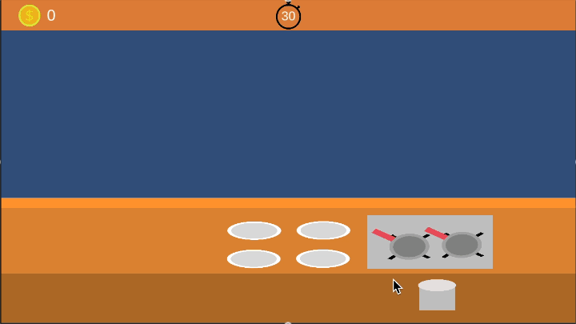

# Showcase

## The Game
Try to mimicing a cooking game where you can cook and serve to customer base on their requirement. Inspired by other game(Tasty World: Cafe diner dash)

### Tools
Unity 2020.3.25f1  
Dotween

### Player Actions
1. Cook the dough to a pan.
2. Put the cooked dough to plate.
3. click the plate to serve to a customer

### How To Install
1. Open this project using Unity 2020.3.25f1
2. navigate and open Assets/Cooking/Scenes/Core.scene
3. Hit play button to try
